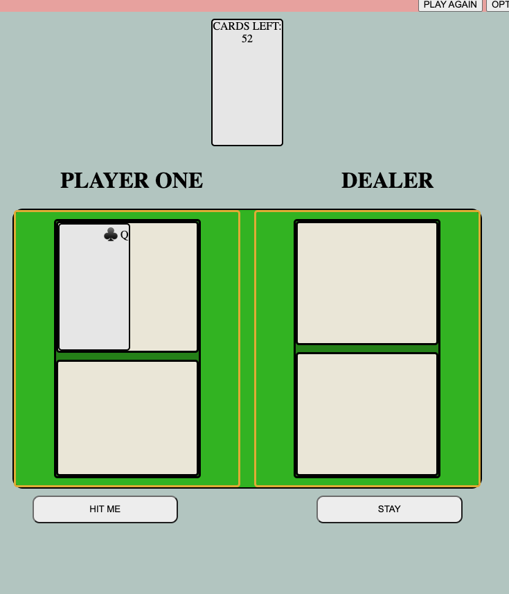
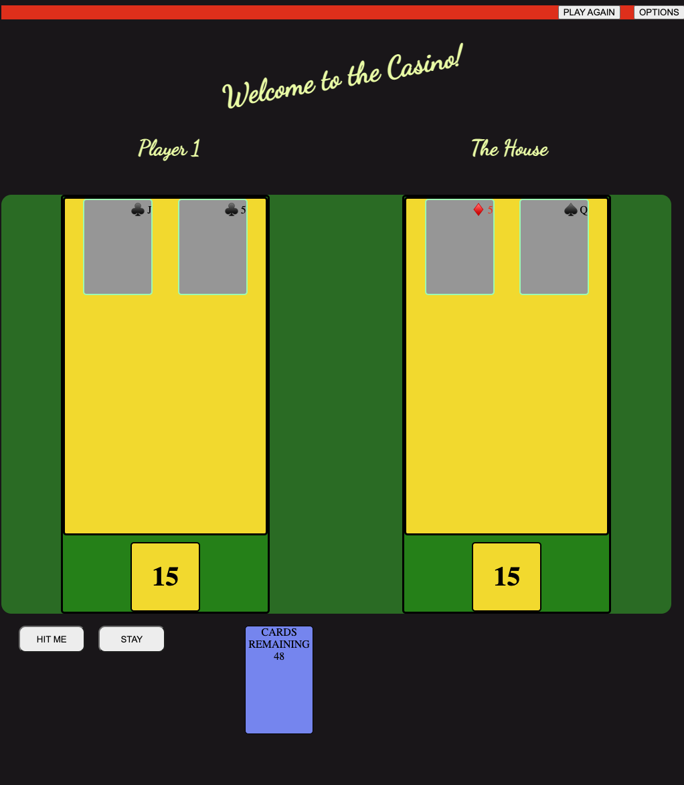
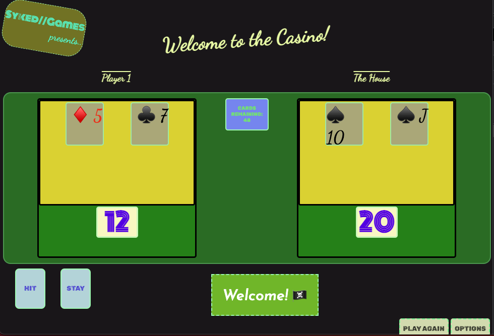

- This is a game of Black Jack. 
- Black jack is a game where the player aims to beat the house (computer) by    achieving a hand whose points total is nearer to 21 than the house's hand without exceeding 21.

- Technologies used in this game include: JavaScript, HTML, & CSS.

- Getting Started: 

    - Link to game: https://calathea-z.github.io/black_jack/ 

- Planned Future Enhancements: 
    1. The ability to bet on hands. 
    2. The ability to split the hand for a side bet. 
    3. Multiplayer inclusion or up to 3 players. 
    4. Color scheme picker that will affect the style of the UI and the playing cards. 
    5. Increased computer AI.

